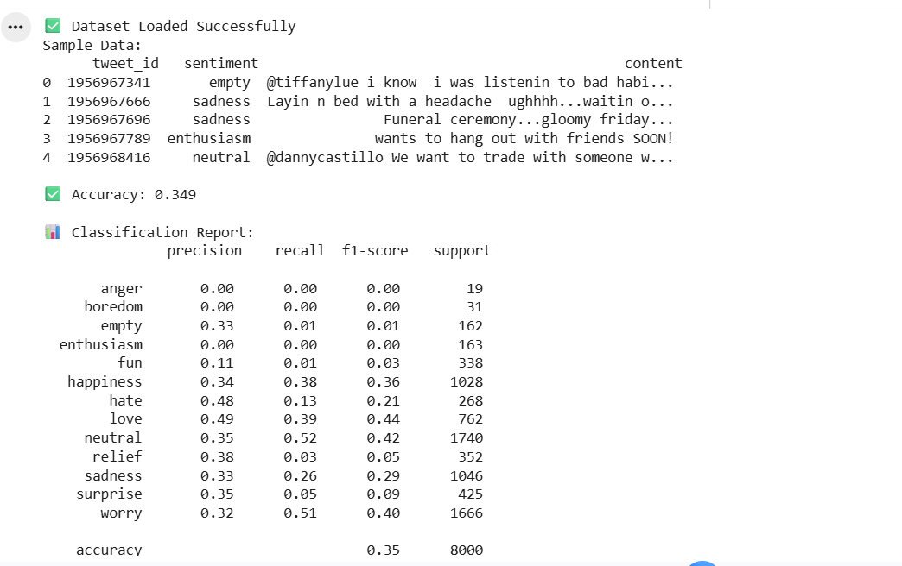

**Tweet Emotion Classification using NLP**

**Project Overview**

This project focuses on analyzing emotions expressed in tweets using Natural Language Processing (NLP). Social media platforms like Twitter contain a large amount of user-generated text that reflects people's feelings and opinions. The goal of this project was to build a machine learning model that can automatically classify tweets into different emotion categories based on their textual content.

The dataset used in this project contains tweets labeled with various emotions such as happiness, sadness, anger, love, and others. By applying NLP techniques and machine learning algorithms, the model attempts to predict the emotion associated with each tweet.

This project helped in understanding how raw text data can be processed and converted into meaningful insights through NLP techniques.

**Objectives**

The main objectives of this project were:
To preprocess raw tweet text and prepare it for machine learning models
To apply Natural Language Processing techniques such as tokenization, stopword removal, and text normalization
To convert textual data into numerical form using vectorization methods
To train a machine learning model capable of predicting emotions from tweets
To evaluate the performance of the model using classification metrics

Dataset Description

The dataset consists of tweets along with their corresponding emotion labels. Each record contains:
tweet_id – Unique identifier for the tweet
content – The actual tweet text
sentiment – The emotion associated with the tweet
The emotion labels include categories such as:
Anger
Boredom
Empty
Enthusiasm
Fun
Happiness
Hate
Love
Neutral
Relief
Sadness
Surprise
Worry

Since the dataset contains multiple emotion categories, this problem is treated as a multi-class text classification task.

**Data Preprocessing**

Before training the model, the tweet text needed to be cleaned and processed. Several preprocessing steps were applied to improve the quality of the input data.

Key preprocessing steps included:
Converting text to lowercase
Removing punctuation and special characters
Removing stopwords (commonly used words that add little meaning)
Tokenization of tweet text
Normalization of words
These steps help reduce noise in the data and improve the performance of the machine learning model.

**Feature Engineering**

Since machine learning algorithms cannot directly understand raw text, the tweet content was transformed into numerical features using vectorization techniques.
The text data was converted into a Bag-of-Words representation, where each tweet is represented by the frequency of words appearing in it. This allows the model to learn patterns between words and the associated emotions.

**Model Training**

After preprocessing and feature engineering, a machine learning classification model was trained on the dataset. The model learns patterns in the tweet text and attempts to predict the corresponding emotion category.

The dataset was split into training and testing sets to evaluate the model's ability to generalize to unseen data.

**Model Evaluation**

  

The performance of the model was evaluated using several classification metrics including:
Precision
Recall
F1-score
Accuracy
These metrics provide insight into how well the model is performing across different emotion categories.

Below is the output of the model evaluation:

The results show the precision, recall, and F1-score for each emotion class along with the overall model accuracy.
Although the accuracy is moderate, this is expected in multi-class emotion classification problems where many categories exist and tweet text can be highly ambiguous.

**Tools and Technologies Used**
The following tools and libraries were used to complete this project:
Python
Pandas
NumPy
NLTK / NLP preprocessing techniques
Scikit-learn
Jupyter Notebook

These tools were used for data preprocessing, feature engineering, model training, and evaluation.

**Key Learnings**
Through this project, I gained practical experience in working with text data and applying Natural Language Processing techniques. Some key learnings include:
Understanding the workflow of an NLP pipeline
Cleaning and preprocessing textual data
Converting text into numerical features
Training and evaluating machine learning models for text classification
Interpreting model performance using classification metrics

**Future Improvements**
This project can be further improved in several ways:
Applying advanced NLP techniques such as TF-IDF vectorization
Using word embeddings for better semantic understanding
Training deep learning models such as LSTM or Transformer-based models

Improving preprocessing techniques to handle emojis, slang, and abbreviations commonly used in tweets
