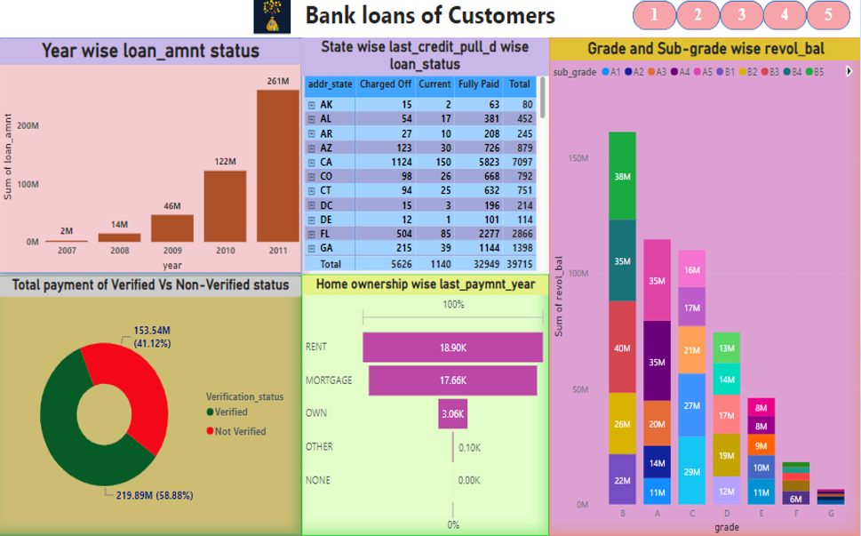

**Bank Loan Analysis Dashboard – Power BI**

**Project Overview**
This project presents an interactive Power BI dashboard focused on analyzing bank loan data of customers to understand loan performance, repayment behavior, and risk patterns. The dashboard was developed to convert raw financial data into meaningful visual insights that can help in monitoring loan distribution, repayment status, and customer segments.
The main aim of this project is to perform analytical exploration of customer loan records and identify trends related to loan amounts, verification status, grades, and repayment outcomes through dynamic visualizations.

**Project Objectives**
The key objectives of this project are:
To analyze customer loan data across multiple dimensions
To understand loan repayment patterns (Fully Paid, Current, Charged Off)
To study the relationship between customer verification and payment behavior
To evaluate loan distribution over years and across states
To build an interactive dashboard for business-level decision support

**Dataset Description**
The dataset used in this project consists of structured bank loan records of customers, including loan status, loan amount, verification status, home ownership, grades, and state-wise data.

**Key attributes used in the analysis:**
Loan Amount
Loan Status (Current, Fully Paid, Charged Off)
Verification Status (Verified vs Non-Verified)
Grade and Sub-grade
State-wise loan distribution
Home Ownership (Rent, Mortgage, Own, etc.)
Revolving Balance (revol_bal)
Last Payment Year

**Data preprocessing steps performed:**
Data cleaning and formatting in Power Query
Handling missing and inconsistent values
Creating calculated measures using DAX
Data transformation for accurate visual representation

**Tools and Technologies Used**
Microsoft Power BI (Data Visualization & Dashboard Development)
Power Query (Data Cleaning and Transformation)
DAX (Measures and Calculations)
Structured Loan Dataset (CSV/Excel)

**Dashboard Features and Visualizations**
The dashboard is designed with multiple analytical views to provide a comprehensive understanding of customer loan behavior:

1. Year-wise Loan Amount Analysis
This visualization shows the total loan amount trend across different years, helping in identifying growth patterns and fluctuations in loan disbursement over time.

2. State-wise Loan Status Analysis
A detailed table visual displaying loan status (Charged Off, Current, Fully Paid) across different states, enabling geographic comparison of loan performance.

3. Grade and Sub-grade Wise Revolving Balance
This stacked bar chart analyzes revolving balance distribution across loan grades and sub-grades, providing insights into credit risk segmentation.

4. Verified vs Non-Verified Payment Analysis
A donut chart comparing total payments made by verified and non-verified customers, helping to understand the impact of verification on repayment behavior.

5. Home Ownership vs Last Payment Year
This visual highlights customer home ownership categories (Rent, Mortgage, Own, etc.) and their relation to last payment patterns.

**Key Insights Derived**
A significant portion of loan payments comes from verified customers compared to non-verified ones.
Loan amounts show an increasing trend over the years, indicating higher loan disbursement in later periods.
Certain loan grades carry higher revolving balances, which may indicate higher financial risk segments.
State-wise analysis reveals variation in loan repayment status across regions.
Customers with different home ownership statuses show varying repayment behaviors.
These insights can help financial institutions in risk assessment, customer profiling, and strategic loan management.

**Repository Contents**
Power BI Dashboard File (.pbix)
Dashboard Screenshot (Preview)
Project Documentation (README)

**How to Use the Dashboard**
Download the .pbix file from this repository
Open it using Microsoft Power BI Desktop
Use slicers and interactive visuals to explore loan trends and customer behavior
Analyze different segments such as grades, states, and verification status

**Project Significance**

This project demonstrates practical skills in data analytics, business intelligence, and financial data visualization. It showcases the ability to transform raw banking data into interactive dashboards that support data-driven decision-making and performance monitoring.

**Author**
This dashboard is part of my Data Analytics Portfolio, highlighting my skills in:
Data Analysis
Financial Data Visualization
Power BI Dashboard Development
Business Intelligence and Reporting
