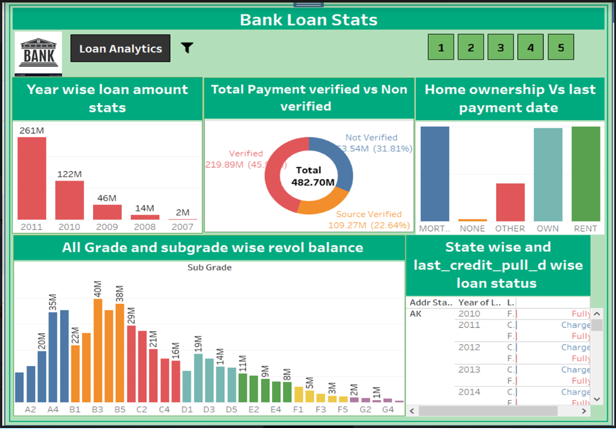

**Tableau Bank Loan Customer Analysis Dashboard**

**Dashboard Preview**

**Project Overview**

This project presents an interactive Tableau dashboard designed to analyze bank loan data of customers. The objective of this analysis is to understand loan distribution, customer verification patterns, repayment behavior, and potential risk indicators. By transforming raw loan data into meaningful visual insights, the dashboard helps in identifying trends related to loan amounts, loan grades, customer verification status, and repayment outcomes.

Financial institutions often need to evaluate loan portfolios to monitor performance and identify potential risk segments. This dashboard provides a consolidated view of customer loan statistics that can support better decision-making in loan management and risk assessment.

**Dashboard Overview**

The dashboard titled “Bank Loan Stats” combines multiple visualizations that provide insights into loan trends and customer characteristics. It allows users to explore the data through different dimensions and understand how loans are distributed across various categories.

The dashboard includes the following analytical sections:

1. Year-wise Loan Amount Statistics
This visualization displays the total loan amount issued across different years. It helps identify how lending activity has changed over time. By observing the yearly distribution, users can quickly understand whether the bank’s lending volume increased or decreased during certain periods.

From the visualization, it can be observed that loan issuance experienced noticeable growth in later years compared to earlier ones, indicating an expansion in lending activities.

2. Total Payment – Verified vs Non-Verified Customers
This donut chart compares total loan payments made by customers whose information was verified versus those who were not verified.
Customer verification is an important risk management step in banking. This chart helps analyze whether verified customers contribute more to total repayments compared to non-verified customers. The visualization highlights the proportion of repayments coming from each category and helps assess potential reliability differences between verified and non-verified borrowers.

3. Home Ownership vs Last Payment Date
This section analyzes loan repayment patterns based on customer home ownership status, such as:
Mortgage
Rent
Own
Other
None
This visualization helps determine how housing status may influence repayment behavior or loan activity. For example, customers who own homes or have mortgages may show different financial patterns compared to renters.

4. Grade and Sub-Grade Wise Revolving Balance
Loans are often categorized by credit grades and sub-grades which represent the borrower’s creditworthiness.
This visualization shows the total revolving balance distribution across different loan grades and sub-grades. It helps identify which credit categories account for larger portions of outstanding balances.
By analyzing these categories, financial analysts can determine which risk segments hold higher loan exposure.

5. State-wise Loan Status
The dashboard also provides a geographical perspective of loan performance. This table displays loan records categorized by state along with the loan status.
Loan statuses typically include:
Fully Paid
Current
Charged Off
This view allows users to observe how loan outcomes differ across regions and helps identify states with higher occurrences of certain loan statuses.

**Key Insights**
From the dashboard analysis, several patterns can be observed:
Loan issuance increased significantly in later years compared to earlier ones.
Verified customers account for a large portion of total loan repayments.
Different home ownership categories show varying repayment patterns.
Certain loan grades and sub-grades contribute more heavily to the overall revolving balance.
Loan status varies across states, indicating potential regional differences in repayment behavior.
These insights can help financial institutions better understand borrower behavior and improve risk management strategies.

**Tools and Technologies Used**
Tableau – Dashboard development and data visualization
Microsoft Excel / Dataset – Data source preparation and formatting

**Files Included in the Repository**
Tableau packaged workbook (.twbx)
Dashboard screenshot
Project documentation (README)

**Project Significance**

This project demonstrates practical skills in data visualization, exploratory data analysis, and financial data interpretation using Tableau. It highlights how interactive dashboards can simplify complex datasets and provide decision-makers with clear, actionable insights.

The dashboard can be further enhanced by integrating additional financial metrics, advanced filters, or predictive analytics to support deeper loan portfolio analysis.
